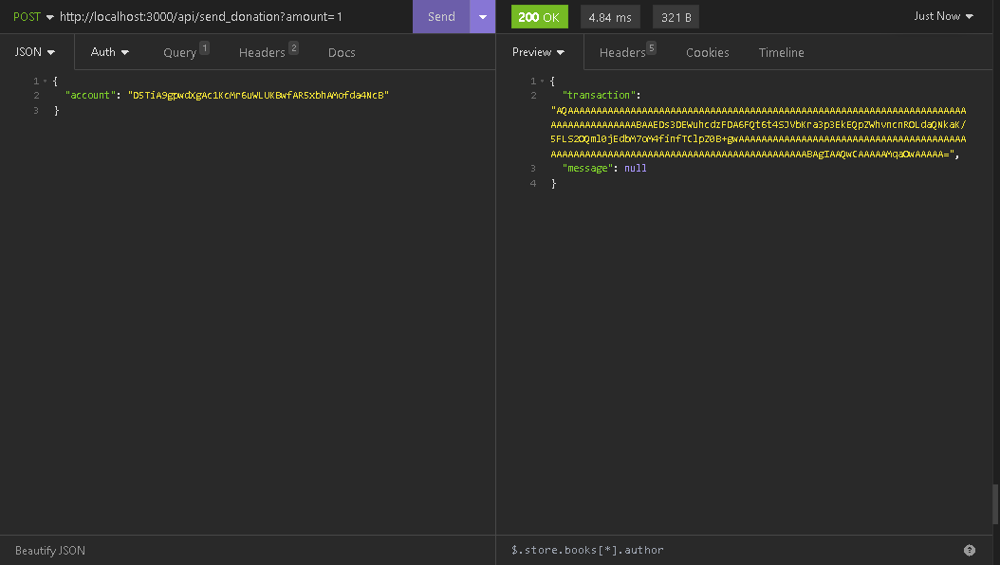

# ZNAP Tutorial - **Donate/Pay a user**

## Description

Alice is a well-known influencer on Twitter. She usually shares research and valuable insights with her audience free of charge. She decides she wants to start a donation campaign for herself. She spins up a “Donate to me” Blink using the Actions Stack and shares the link to Sphere on Twitter.The link unfurls into an actionable Blink containing the following information:

1. Her image, name, description
2. 3 buttons: 1 SOL, 5 SOL, 10 SOL
3. 4th button with an input field: “Enter a custom SOL amount”

## Brief review

Solana Actions are APIs compatible with the Solana Actions Specification. Our Solana Actios must be able to return:

1. Action Metadata
2. A transaction which will be sent to the Solana blockchain.

## Let's start!

Firstly, we will create our workspace using `znap-cli`. If you do not have `znap-cli` installed, follow our guide [here](https://github.com/heavy-duty/znap/blob/master/INSTALLATION.md).

Then, let's create a new project with `znap init <project-name>`


### 1. Let's create our action collection for Alice's campaign

In the root of your project run the following command to create a collection `znap new alice_campaign`, this command will create a new action collection called 'alice_campaign' inside /collections folder, where we will be our actions for Alice.

Then, you will see a message like: 

```bash
You are about to create a collection named: alice_campaign

  Added:

      + collections/alice_campaign/Cargo.toml
      + collections/alice_campaign/src/lib.rs

  Modified:

      * ./Znap.toml
```

Now, let's open our lib.rs file where will create our actions. The file will look like this:

```rust
use znap::prelude::*;

#[collection]
pub mod alice_campaign {
    use super::*;
}
```

### 2. Let's import all necessary libraries

Will import 3 necessary libraries: 

- `solana-sdk`: Base library for off-chain programs that interact with Solana and its data structures.
- `std`: essential collection of functionalities to work with Rust.
- `znap`: Framework to build APIs compatible with Solana Actions specification.

```rust
use solana_sdk::{
    message::Message, native_token::LAMPORTS_PER_SOL, pubkey, pubkey::Pubkey,
    system_instruction::transfer, transaction::Transaction,
};
use std::str::FromStr;
use znap::prelude::*;

#[collection]
pub mod alice_campaign {
    use super::*;
}
```

### 3. Setup our Solana Action's metadata

We must setup all necessary information to comply with the Solana Actions Specefication. This is really important because clients must be able to correctly get all the metadata (GET Request) to create blinks using our Solana actions.

- **Title:** Action's Title
- **Icon:** Action's Icon
- **Description:** Description about the purpose of the Action
- **Label:** Text for the main button shown to the user
- **Link/s:** Buttons or inputs where the user will be able to get a transaction to be sent to the blockchain (POST Request).

We will use the macros `#[derive]`, `#[action]` ant the trait `Action` to create our Solana Action's metadata.

```rust
use solana_sdk::{
    message::Message, native_token::LAMPORTS_PER_SOL, pubkey, pubkey::Pubkey,
    system_instruction::transfer, transaction::Transaction,
};
use std::str::FromStr;
use znap::prelude::*;

#[collection]
pub mod alice_campaign {
    use super::*;
}

#[derive(Action)]
#[action(
    icon = "https://media.discordapp.net/attachments/1205590693041541181/1212566609202520065/icon.png?ex=667eb568&is=667d63e8&hm=0f247078545828c0a5cf8300a5601c56bbc9b59d3d87a0c74b082df0f3a6d6bd&=&format=webp&quality=lossless&width=660&height=660",
    title = "Alice's website",
    description = "Website to make a donation to Alice",
    label = "Send",
    link = {
        label = "Send 1 SOL",
        href = "/api/send_donation?amount=1",
    },
    link = {
        label = "Send 5 SOL",
        href = "/api/send_donation?amount=5",
    },
    link = {
        label = "Send 10 SOL",
        href = "/api/send_donation?amount=10",
    },
    link = {
        label = "Send SOL",
        href = "/api/send_donation?amount={amount}",
        parameter = { label = "Enter a custom SOL amount", name = "amount" }
    },
)]

pub struct SendDonationAction;
```

### 4. Define Query and Custom Errors

Now, in this step we will define our query param for our function, which we will create in the next step. Like Anchor contexts, our query param allows our function to be able to know what information to work with to complete our purpose.

we use the macro `#[query]` to define query param structs and their expected data.

```rust
#[query]
pub struct SendDonationQuery {
    pub amount: u64,
}
```

The above struct is our query param for our function, this query param will allow us to access the amount they wish to donate.

Added, we will create a custom error message for our function in case the requester's public key is wrong.

```rust
#[derive(ErrorCode)]
enum ActionError {
    #[error(msg = "Invalid account public key")]
    InvalidAccountPublicKey,
}
```

Now, you have to have something like this:

```rust
use solana_sdk::{
    message::Message, native_token::LAMPORTS_PER_SOL, pubkey, pubkey::Pubkey,
    system_instruction::transfer, transaction::Transaction,
};
use std::str::FromStr;
use znap::prelude::*;

#[collection]
pub mod alice_campaign {
    use super::*;
}

#[derive(Action)]
#[action(
    icon = "https://media.discordapp.net/attachments/1205590693041541181/1212566609202520065/icon.png?ex=667eb568&is=667d63e8&hm=0f247078545828c0a5cf8300a5601c56bbc9b59d3d87a0c74b082df0f3a6d6bd&=&format=webp&quality=lossless&width=660&height=660",
    title = "Alice's website",
    description = "Website to make a donation to Alice",
    label = "Send",
    link = {
        label = "Send 1 SOL",
        href = "/api/send_donation?amount=1",
    },
    link = {
        label = "Send 5 SOL",
        href = "/api/send_donation?amount=5",
    },
    link = {
        label = "Send 10 SOL",
        href = "/api/send_donation?amount=10",
    },
    link = {
        label = "Send SOL",
        href = "/api/send_donation?amount={amount}",
        parameter = { label = "Enter a custom SOL amount", name = "amount" }
    },
)]

pub struct SendDonationAction;

#[query]
pub struct SendDonationQuery {
    pub amount: u64,
}

#[derive(ErrorCode)]
enum ActionError {
    #[error(msg = "Invalid account public key")]
    InvalidAccountPublicKey,
}
```

### 5. Create a transaction to be sent

In this step, we will create our function `send_donation` which will create a transaction which will be sent to the blockchain.

Firstly, we declare our function with the contexts it will use, which we created in the previous step.

```rust
    pub fn send_donation(
        ctx: Context<SendDonationAction, SendDonationQuery>
    ) -> Result<Transaction> {

    }
```

Now, we obtain and validate if the applicant's public key is valid, if not we return an error.

```rust
    pub fn send_donation(
        ctx: Context<SendDonationAction, SendDonationQuery>
    ) -> Result<Transaction> {
        let account_pubkey = match Pubkey::from_str(&ctx.payload.account) {
            Ok(account_pubkey) => account_pubkey,
            _ => return Err(Error::from(ActionError::InvalidAccountPublicKey)),
        };
    }
```

If the public key is valid, we set the public key of the receiver (Alice) and create the instructions for our transfer transaction.

To create the instructions we use the `ctx.query.amount` to get the amount sent by the requester (client)

```rust
    pub fn send_donation(
        ctx: Context<SendDonationAction, SendDonationQuery>
    ) -> Result<Transaction> {
        let account_pubkey = match Pubkey::from_str(&ctx.payload.account) {
            Ok(account_pubkey) => account_pubkey,
            _ => return Err(Error::from(ActionError::InvalidAccountPublicKey)),
        };
        let receiver_pubkey = pubkey!("6GBLiSwAPhDMttmdjo3wvEsssEnCiW3yZwVyVZnhFm3G");
        let transfer_instruction = transfer(
            &account_pubkey,
            &receiver_pubkey,
            ctx.query.amount * LAMPORTS_PER_SOL,
        );
    }
```

Finally, we create a message with our instructions to communicate that everything went well.

And we create and return an unsigned transaction with the instructions we created.

```rust
    pub fn send_donation(
        ctx: Context<SendDonationAction, SendDonationQuery>
    ) -> Result<Transaction> {
        let account_pubkey = match Pubkey::from_str(&ctx.payload.account) {
            Ok(account_pubkey) => account_pubkey,
            _ => return Err(Error::from(ActionError::InvalidAccountPublicKey)),
        };
        let receiver_pubkey = pubkey!("6GBLiSwAPhDMttmdjo3wvEsssEnCiW3yZwVyVZnhFm3G");
        let transfer_instruction = transfer(
            &account_pubkey,
            &receiver_pubkey,
            ctx.query.amount * LAMPORTS_PER_SOL,
        );

        let transaction_message = Message::new(&[transfer_instruction], None);

        Ok(Transaction::new_unsigned(transaction_message))
    }
```

And that was it! We made it

Your final project should look like this:

```rust
use solana_sdk::{
    message::Message, native_token::LAMPORTS_PER_SOL, pubkey, pubkey::Pubkey,
    system_instruction::transfer, transaction::Transaction,
};
use std::str::FromStr;
use znap::prelude::*;

#[collection]
pub mod my_actions {
    use super::*;

    pub fn send_donation(
        ctx: Context<SendDonationAction, SendDonationQuery>
    ) -> Result<Transaction> {
        let account_pubkey = match Pubkey::from_str(&ctx.payload.account) {
            Ok(account_pubkey) => account_pubkey,
            _ => return Err(Error::from(ActionError::InvalidAccountPublicKey)),
        };
        let receiver_pubkey = pubkey!("6GBLiSwAPhDMttmdjo3wvEsssEnCiW3yZwVyVZnhFm3G");
        let transfer_instruction = transfer(
            &account_pubkey,
            &receiver_pubkey,
            ctx.query.amount * LAMPORTS_PER_SOL,
        );
        let transaction_message = Message::new(&[transfer_instruction], None);

        Ok(Transaction::new_unsigned(transaction_message))
    }
}

#[derive(Action)]
#[action(
    icon = "https://media.discordapp.net/attachments/1205590693041541181/1212566609202520065/icon.png?ex=667eb568&is=667d63e8&hm=0f247078545828c0a5cf8300a5601c56bbc9b59d3d87a0c74b082df0f3a6d6bd&=&format=webp&quality=lossless&width=660&height=660",
    title = "Alice's website",
    description = "Website to make a donation to Alice",
    label = "Send",
    link = {
        label = "Send 1 SOL",
        href = "/api/send_donation?amount=1",
    },
    link = {
        label = "Send 5 SOL",
        href = "/api/send_donation?amount=5",
    },
    link = {
        label = "Send 10 SOL",
        href = "/api/send_donation?amount=10",
    },
    link = {
        label = "Send SOL",
        href = "/api/send_donation?amount={amount}",
        parameter = { label = "Enter a custom SOL amount", name = "amount" }
    },
)]
pub struct SendDonationAction;

#[query]
pub struct SendDonationQuery {
    pub amount: u64,
}

#[derive(ErrorCode)]
enum ActionError {
    #[error(msg = "Invalid account public key")]
    InvalidAccountPublicKey,
}
```

🎉 CONGRATULATIONS, YOU HAVE CREATED YOUR FIRST SOLANA ACTION WITH ZNAP 🎉

### 6. ¡Let's test our action!

In the root of your terminal run `znap serve`

It will start building your project and when finished it will start a server for your actions to be consumed.

If everything went well, you should see something like this:

```bash
✨ Znap Server ✨

 Service is running at http://localhost:3000

[my_actions] endpoints:

  GET      /api/send_donation
  POST     /api/send_donation

💡 Press Ctrl+C to stop the server
```

Now if you consume your endpoint with a GET method you will get the metadata of your Solana Action.


And if you consume your endpoint with a POST method, setting the query param `amount` to 1 or another number, you will get a Solana unsigned transaction to be sent to the blockchain.



